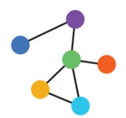

<!--<!DOCTYPE html>-->
<html lang="en">

<!--<head>-->

<!-- title and meta -->
<meta charset="utf-8" />
<meta name="viewport" content="width=device-width,initial-scale=1.0" />
<meta name="description" content="" />

<title> Animated Movies |  Social Graphs 2020</title>

<!-- css -->
<link href='https://fonts.googleapis.com/css?family=Ubuntu:300,400,700,400italic' rel='stylesheet' type='text/css'>
<link href='https://fonts.googleapis.com/css?family=Oswald:400,300,700' rel='stylesheet' type='text/css'>
<link rel="stylesheet" href="css/style.css" />
<!--<link rel="stylesheet" href="css/twitter-quotes.css">-->
<link rel="stylesheet" href="css/switch.css" />
<link rel="stylesheet" type="text/css" href="css/slick.css"/>
<link rel="stylesheet" type="text/css" href="css/slick-theme.css"/>
<link rel="stylesheet" type="text/css" href="css/bar.css"/>

<!-- js -->
<script src="js/classie.js"></script>
<script src="js/jquery-3.1.1.min.js"></script>
<script src="js/scroll.js"></script>
<script src="js/quotes.js"></script>
<script src="js/masonry.pkgd.min.js"></script>
<script src="js/jquery.flexslider-min.js"></script>
<script src="nodes_modules/d3/build/d3.min.js"></script>
<script src="nodes_modules/d3-tip/index.js"></script>


<!-- </header>/header -->

<div id="main" class="first_main">
    <div id="content">
        <section id="one">
            <div class="container">
                <h1 id="contenttitle">Contents</h1>

                <p align="center"> <!--<class="contents">-->
                    <a href="#sentiments"><br>
                    &rarr; Sentiment Analysis</a><br><br>
                    <a href="#network"><br>
                    &rarr; Network Analysis</a><br><br>
                </p>
            </div>
        </section>
        <section class="color" id="sentiments">
            <div class="container">
                <h1>Sentiemnt analysis</h1>
                <p>Emotions are everywhere. Especially in politics.<br>
                Recently, The Oxford Dictionaries announced that its Word of the Year 2016 is <b>post-truth</b>.<br>
                </p>
                

                <blockquote><p>‘relating to or denoting circumstances in which objective facts are less influential <br>in shaping public opinion than appeals to emotion and personal belief’</p>
                <br><span>- 'Post-truth' according to The Oxford Dictionaries</span></blockquote>
                <p>The frequent use of a word such as 'post-truth' indicates that people seem to think that politics are increasingly
                  prefering emotions to fact. Pathos to logos. But is this true? We investigated how emotions are showing in the
                  Danish parliament and on Danish politicians' Twitter feeds. The Danish parliament dataset was extracted using web scraping from transcipted parliament meetings and
                  the twitter dataset was generated using the twitter API and contains tweets from 149 Danish politicians.</p>

                <h2>Emotions over time</h2>
                <p>Let's get an overview of the emotional spectrum by looking at the weekly average of emotions on Danish politicians' Twitter and in the parliament:</p>

                
                <p>The graphs seem to be quite well correlated. It should be noted that the method of calculating the sentiments was to add up positive and negative sentiment values of each word in a text. Averaging the blocks of text makes it more likely for longer text blocks to have extreme values (positive or negative), which is probably why the sentiment of the parliament is generally higher than on twitter.</p>

                <h1>How are politicians sentiment in the parliament compared to their twitter sentiment?</h1>
                <p>
                  We sometimes experience that people behave different in real life compared to their online behaviour. Examining the sentiment of tweets from danish politicians
                  and comparing it to the sentiment of when they are talking in the parliament meetings shows the average and standard deviation of each politicians sentiment both on
                  twitter and in the meetings. A high average sentiment and low standard deviation sentiment implies a high sentiment in general while a high standard deviation implies
                  a high level of expressivenes.
                <br>
                Top 3 positive tweets:</p>

                <div class="cd-testimonials-wrapper cd-container positive">
                    <ul class="cd-testimonials">
                        <li>
                            <p>I dag er det DFs fødselsdag hurra hurra hurra
                            Vi sikkert mange gaver får
                            Som vi har ønsket os i år
                            For 21 år er vel en gave værd
                            #dkpol</p>
                            <div class="cd-author">
                                
                                <ul class="cd-author-info">
                                    <li>Morten Marinus</li>
                                    <li>DF</li>
                                </ul>
                                <span class="cd-number">1.</span>
                            </div>
                        </li>

                        <li>
                            <p>"Messerschmidt har aldrig sat sig ind i, hvordan EU fungerer..." (citat Anna Rosbach i Berlingske). Ha-ha-ha-ha-ha-ha-ha-ha-ha-ha..! #dkpol</p>
                            <div class="cd-author">
                                
                                <ul class="cd-author-info">
                                    <li>Søren Espersen</li>
                                    <li>DF</li>
                                    <span class="cd-number">2.</span>
                                </ul>
                            </div>
                        </li>

                        <li>
                            <p>Hej @FradragNu - Det er mig der takker for super god inspiration til iværksætterpolitik hos @Spolitik - held og lykke med fradrag.nu #dkpol</p>
                            <div class="cd-author">
                                
                                <ul class="cd-author-info">
                                    <li>Thomas Jensen</li>
                                    <li>Socialdemokraterne</li>
                                    <span class="cd-number">3.</span>
                                </ul>
                            </div>
                        </li>

                    </ul> <!-- cd-testimonials -->

                    <a href="#0" class="cd-see-all">See all</a>
                </div> <!-- cd-testimonials-wrapper -->

                <h2>DF seems to be the happiest party on Twitter, but...</h2>
                <p>Søren Espersen's tweet that is ranked as the second happiest in our records is a great example of a quirk when calculating sentiments using a list of labelled words.<br>
                When reading the tweet as a human, it is obvious that the tweet is sarcastic and not very positive. However, being limited to look at each word, our algorithm count the long string of Ha-ha-ha... as very positive. <br>
                Now, let's have a look at the top 3 negative tweets:</p>

                <div class="cd-testimonials-wrapper cd-container negative">
                    <ul class="cd-testimonials">
                        <li>
                            <p>Fuck fuck fuck Andrew er ikke videre. Øv!!! En voksen mand m rock under vesten - og så kunne han synge. Fuck! #xfactordr</p>
                            <div class="cd-author">
                                
                                <ul class="cd-author-info">
                                    <li>Pia Olsen Dyhr</li>
                                    <li>SF</li>
                                </ul>
                                <span class="cd-number">1.</span>
                            </div>
                        </li>

                        <li>
                            <p>WTF? @sorenpind kobler skærpet straf for voldtægt og skærpet straf for falsk anklage #usagligt #sexisme #dkpol https://t.co/eNbeEtoH5x</p>
                            <div class="cd-author">
                                
                                <ul class="cd-author-info">
                                    <li>Pernille Skipper</li>
                                    <li>Enhedslisten</li>
                                    <span class="cd-number">2.</span>
                                </ul>
                            </div>
                        </li>

                        <li>
                            <p>@ElisabethMJ @Kvindemuseet @finanslov øv, øv, øv, øv og sgu altså. Helt forkert. @rasmusnordqvist har du set det her?</p>
                            <div class="cd-author">
                                
                                <ul class="cd-author-info">
                                    <li>Uffe Elbæk</li>
                                    <li>Alternativet</li>
                                    <span class="cd-number">3.</span>
                                </ul>
                            </div>
                        </li>

                    </ul> <!-- cd-testimonials -->

                    <a href="#0" class="cd-see-all">See all</a>
                </div> <!-- cd-testimonials-wrapper -->

                <p>The most negative tweets ranges from angry, to sad, to ... X-Factor.<br>
                One interesting observation is the distribution of positive/negative politicians based on their party. The top positive tweets mostly include right-wing politicians, while the top negative tweets only include left-wing politicians.</p>

                <div class="cd-testimonials-all">
                    <div class="cd-testimonials-all-wrapper">
                        <ul>
                            <li class="cd-testimonials-item">
                            <p>I dag er det DFs fødselsdag hurra hurra hurra
                            Vi sikkert mange gaver får
                            Som vi har ønsket os i år
                            For 21 år er vel en gave værd
                            #dkpol</p>
                            <div class="cd-author">
                                
                                <ul class="cd-author-info">
                                    <li>Morten Marinus</li>
                                    <li>DF</li>
                                </ul>
                            </div>
                        </li>

                        <li class="cd-testimonials-item">
                            <p>"Messerschmidt har aldrig sat sig ind i, hvordan EU fungerer..." (citat Anna Rosbach i Berlingske). Ha-ha-ha-ha-ha-ha-ha-ha-ha-ha..! #dkpol</p>
                            <div class="cd-author">
                                
                                <ul class="cd-author-info">
                                    <li>Søren Espersen</li>
                                    <li>DF</li>
                                </ul>
                            </div>
                        </li>

                        <li class="cd-testimonials-item">
                            <p>Hej @FradragNu - Det er mig der takker for super god inspiration til iværksætterpolitik hos @Spolitik - held og lykke med fradrag.nu #dkpol</p>
                            <div class="cd-author">
                                
                                <ul class="cd-author-info">
                                    <li>Thomas Jensen</li>
                                    <li>Socialdemokraterne</li>
                                </ul>
                            </div>
                        </li>

                        <li class="cd-testimonials-item">
                            <p>@KlausKblog Fantastisk! Super godt gået!! Jeg bliver glad i låget over folk som os.. haha :-)</p>
                            <div class="cd-author">
                                
                                <ul class="cd-author-info">
                                    <li>Laura Lindahl</li>
                                    <li>LA</li>
                                </ul>
                            </div>
                        </li>

                        <li class="cd-testimonials-item">
                            <p>Jeg var enig med HTS i denne del: "Danmark længe leve! Hurra, hurra, hurra!" #ftlive #dkpol</p>
                            <div class="cd-author">
                                
                                <ul class="cd-author-info">
                                    <li>Merete Riisager</li>
                                    <li>LA</li>
                                </ul>
                            </div>
                        </li>

                        <li class="cd-testimonials-item negative">
                            <p>Fuck fuck fuck Andrew er ikke videre. Øv!!! En voksen mand m rock under vesten - og så kunne han synge. Fuck! #xfactordr</p>
                            <div class="cd-author">
                                
                                <ul class="cd-author-info">
                                    <li>Pia Olsen Dyhr</li>
                                    <li>SF</li>
                                </ul>
                            </div>
                        </li>

                        <li class="cd-testimonials-item negative">
                            <p>WTF? @sorenpind kobler skærpet straf for voldtægt og skærpet straf for falsk anklage #usagligt #sexisme #dkpol https://t.co/eNbeEtoH5x</p>
                            <div class="cd-author">
                                
                                <ul class="cd-author-info">
                                    <li>Pernille Skipper</li>
                                    <li>Enhedslisten</li>
                                </ul>
                            </div>
                        </li>

                        <li class="cd-testimonials-item negative">
                            <p>@ElisabethMJ @Kvindemuseet @finanslov øv, øv, øv, øv og sgu altså. Helt forkert. @rasmusnordqvist har du set det her?</p>
                            <div class="cd-author">
                                
                                <ul class="cd-author-info">
                                    <li>Uffe Elbæk</li>
                                    <li>Alternativet</li>
                                </ul>
                            </div>
                        </li>

                        <li class="cd-testimonials-item negative">
                            <p>Frygtelige nyheder fra Paris- igen. Al den vold, terror og drab på uskyldige  mennesker. Tragisk.</p>
                            <div class="cd-author">
                                
                                <ul class="cd-author-info">
                                    <li>Jonas Dahl</li>
                                    <li>SF</li>
                                </ul>
                            </div>
                        </li>

                        <li class="cd-testimonials-item negative">
                            <p>Voldtægt er aldrig din skyld. Offer skal ikke efterlades med skam og angst for ikke at blive taget alvorligt #dkpol https://t.co/9OgTSdqe08</p>
                            <div class="cd-author">
                                
                                <ul class="cd-author-info">
                                    <li>Trine Schøning Torp</li>
                                    <li>SF</li>
                                </ul>
                            </div>
                        </li>
                        </ul>
                    </div>  <!-- cd-testimonials-all-wrapper -->

            </div>
        </section>
        </section>
    </div>
</div><!-- #main -->


## Motivation

Relationship between disneys movies.


## Download link
[Data for project](https://github.com/signemik/SocialGraphsAnimateMovies/blob/main/Download/Movie_Data.xlsx?raw=true)


<!--
## Welcome to GitHub Pages
<!--
You can use the [editor on GitHub](https://github.com/signemik/SocailGraphsAnimateMovies/edit/main/README.md) to maintain and preview the content for your website in Markdown files.
<!--
Whenever you commit to this repository, GitHub Pages will run [Jekyll](https://jekyllrb.com/) to rebuild the pages in your site, from the content in your Markdown files.
<!--
### Markdown
<!--
Markdown is a lightweight and easy-to-use syntax for styling your writing. It includes conventions for
<!--
```markdown
Syntax highlighted code block
<!--
# Header 1
## Header 2
### Header 3
<!--
- Bulleted
- List
<!--
1. Numbered
2. List
<!--
**Bold** and _Italic_ and `Code` text
<!--
## Images
 
<!--This is a comment-->
<!---->
<!--
[Link](url) and 
```
<!--
For more details see [GitHub Flavored Markdown](https://guides.github.com/features/mastering-markdown/).
<!--
### Jekyll Themes
<!--
Your Pages site will use the layout and styles from the Jekyll theme you have selected in your [repository settings](https://github.com/signemik/SocailGraphsAnimateMovies/settings). The name of this theme is saved in the Jekyll `_config.yml` configuration file. -->
<!--
### Support or Contact
<!--
Having trouble with Pages? Check out our [documentation](https://docs.github.com/categories/github-pages-basics/) or [contact support](https://github.com/contact) and we’ll help you sort it out.
