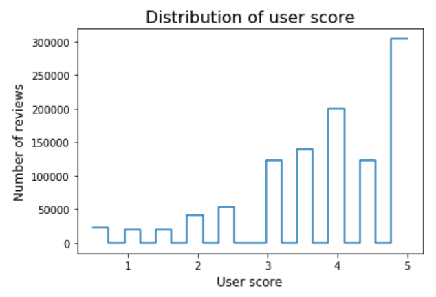
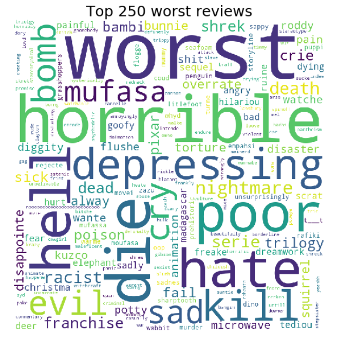

<!--<!DOCTYPE html>-->
<html lang="en">

<!--<head>-->

<!-- title and meta -->
<meta charset="utf-8" />
<meta name="viewport" content="width=device-width,initial-scale=1.0" />
<meta name="description" content="" />

<title> Animated Movies |  Social Graphs 2020</title>

<!-- css -->
<link href='https://fonts.googleapis.com/css?family=Ubuntu:300,400,700,400italic' rel='stylesheet' type='text/css'>
<link href='https://fonts.googleapis.com/css?family=Oswald:400,300,700' rel='stylesheet' type='text/css'>
<link rel="stylesheet" href="css/style.css" />
<!--<link rel="stylesheet" href="css/twitter-quotes.css">-->
<link rel="stylesheet" href="css/switch.css" />
<link rel="stylesheet" type="text/css" href="css/slick.css"/>
<link rel="stylesheet" type="text/css" href="css/slick-theme.css"/>
<link rel="stylesheet" type="text/css" href="css/bar.css"/>

<!-- js -->
<script src="js/classie.js"></script>
<script src="js/jquery-3.1.1.min.js"></script>
<script src="js/scroll.js"></script>
<script src="js/parallaxImg.js" type="text/javascript"></script>
<script src="js/parallaxImg.js"></script>
<script src="js/quotes.js"></script>
<script src="js/select.js"></script>
<script src="js/masonry.pkgd.min.js"></script>
<script src="js/jquery.flexslider-min.js"></script>
<script src="nodes_modules/d3/build/d3.min.js"></script>
<script src="nodes_modules/d3-tip/index.js"></script>
<script src="js/jquery.js" type="text/javascript"></script>
<meta name="viewport" content="width=device-width, initial-scale=1">
<link rel="stylesheet" href="https://www.w3schools.com/w3css/4/w3.css">
<style>
* {
  box-sizing: border-box;
}

.column {
  float: left;
  width: 50%;
  padding: 20px;
}

/* Clearfix (clear floats) */
.row::after {
  content: "";
  clear: both;
  display: table;
}
</style>


<h1 id="Motivation">Motivation</h1>

Relationship between disneys movies. 

<p style="color:blue;"><a href="https://github.com/signemik/SocialGraphsAnimateMovies/blob/main/Download/Movie_Data.xlsx">View Data</a>


<h1 id="contenttitle">Contents</h1>
                <p align="center"> <!--<class="contents">-->
                    <a href="#statistics"><br>
                    &rarr; Statistics</a><br><br>
                    <a href="#network"><br>
                    &rarr; Network Analysis</a><br><br>
                    <a href="#sentiments"><br>
                    &rarr; Sentiment Analysis</a><br><br>
                </p>
          
  
  
<section class="color" id="statistics">
 <div class="container">
       <h1>Statistics</h1>
   
   Below can the distribution of number of movies in the different production studios be seen.
   <table rules="groups">
  <thead>
    <tr>
      <th style="text-align: center">Production Studio</th>
      <th style="text-align: center">Number of movies</th>
     </tr>
  </thead>
  <tbody>
    <tr>
      <td style="text-align: left">Sullivan Bluth Studio</td>
      <td style="text-align: left">8</td>
    </tr>
    <tr>
      <td style="text-align: left">DreamWorks</td>
      <td style="text-align: left">38</td>
    </tr>
    <tr>
      <td style="text-align: left">Blue Sky</td>
      <td style="text-align: left">13</td>
    </tr>
    <tr>
      <td style="text-align: left">Illumation</td>
      <td style="text-align: left">10</td>
    </tr>
    <tr>
      <td style="text-align: left">Warner Bros. Animation productions</td>
      <td style="text-align: left">15</td>
    </tr>
    <tr>
      <td style="text-align: left">Sony Pictures Animation productions</td>
      <td style="text-align: left">19</td>
    </tr>
    <tr>
      <td style="text-align: left">Pixar</td>
      <td style="text-align: left">23</td>
    </tr>
    <tr>
      <td style="text-align: left">Disney</td>
      <td style="text-align: left">95</td>
    </tr>
  </tbody>
</table>

 <p align="center">
  
<h2>User score</h2>
   <div class="row">
  <div class="column">
    
  </div>
  <div class="column">
    
  </div><\p>
   
 <h3>Top 5 movies based on average user scores</h3>
<table rules="groups">
  <thead>
    <tr>
      <th style="text-align: center">Movie</th>
      <th style="text-align: center">Average User Score</th>
      <th style="text-align: center">Production studio</th>
    </tr>
  </thead>
  <tbody>
    <tr>
      <td style="text-align: left">Spider-Man: Into the Spider-Verse</td>
      <td style="text-align: left">4.61</td>
      <td style="text-align: left">Sony Pictures Animation productions</td>
    </tr>
    <tr>
      <td style="text-align: left">Coco</td>
      <td style="text-align: left">4.56</td>
      <td style="text-align: left">Pixar</td>
    </tr>
    <tr>
      <td style="text-align: left">Abominable</td>
      <td style="text-align: left">4.49</td>
      <td style="text-align: left">Dreamworks</td>
    </tr>
    <tr>
      <td style="text-align: left">Toy Story 3</td>
      <td style="text-align: left">4.48</td>
      <td style="text-align: left">Pixar</td>
    </tr>
    <tr>
      <td style="text-align: left">The Lion King (1994)</td>
      <td style="text-align: left">4.45</td>
      <td style="text-align: left">Disney</td>
    </tr>
  </tbody>
</table>

<h3>Worst 5 movies based on average user scores</h3>
<table rules="groups">
  <thead>
    <tr>
      <th style="text-align: center">Movie</th>
      <th style="text-align: center">Average User Score</th>
      <th style="text-align: center">Production studio</th>
    </tr>
  </thead>
  <tbody>
    <tr>
      <td style="text-align: left">Ice Age: Collision Course</td>
      <td style="text-align: left">2.42</td>
      <td style="text-align: left">Blue Sky</td>
    </tr>
    <tr>
      <td style="text-align: left">The Emoji Movie</td>
      <td style="text-align: left">2.64</td>
      <td style="text-align: left">Sony Pictures Animation productions</td>
    </tr>
    <tr>
      <td style="text-align: left">Home on the Range</td>
      <td style="text-align: left">2.68</td>
      <td style="text-align: left">Disney</td>
    </tr>
    <tr>
      <td style="text-align: left">The Wild</td>
      <td style="text-align: left">2.68</td>
      <td style="text-align: left">Disney</td>
    </tr>
    <tr>
      <td style="text-align: left">Doug's 1st Movie</td>
      <td style="text-align: left">2.74</td>
      <td style="text-align: left">Disney</td>
    </tr>
  </tbody>
</table>


  <!--<h2>Plots</h2>-->
  <p>Some text.</p>
</div>
hello

text
    
    
    
    
<section class="color" id="network">
    <div class="container">
        <h1>Network analysis </h1>
      
      some text <br>
      <p align="center">
      
       
      <br>
      some taxt
      Communities graph<br>
       
      <br>

            <style>
.mySlides {display:none}
</style>
<body>

<div class="w3-container">
  <h2>Word clouds for communities</h2>
  <p>WordCloulds.</p>
</div>


<div class="w3-content" style="max-width:800px">
  <p align="center">
  
  
  
  
  
  
  
  
  
  </p>
</div>
<div class="w3-center">
  <div class="w3-section">
    <button class="w3-button w3-light-grey" onclick="plusDivs(-1)">❮ Prev</button>
    <button class="w3-button w3-light-grey" onclick="plusDivs(1)">Next ❯</button>
  </div>
 <button class="w3-button demo" onclick="currentDiv(1)">1</button> 
  <button class="w3-button demo" onclick="currentDiv(2)">2</button> 
  <button class="w3-button demo" onclick="currentDiv(3)">3</button>
  <button class="w3-button demo" onclick="currentDiv(4)">4</button>
  <button class="w3-button demo" onclick="currentDiv(5)">5</button>
  <button class="w3-button demo" onclick="currentDiv(6)">6</button>
  <button class="w3-button demo" onclick="currentDiv(7)">7</button>
  <button class="w3-button demo" onclick="currentDiv(8)">8</button>
  <button class="w3-button demo" onclick="currentDiv(9)">9</button>
</div>

<script>
 var slideIndex = 1;
showDivs(slideIndex);

function plusDivs(n) {
  showDivs(slideIndex += n);
}

function currentDiv(n) {
  showDivs(slideIndex = n);
}

function showDivs(n) {
  var i;
  var x = document.getElementsByClassName("mySlides");
  var dots = document.getElementsByClassName("demo");
  if (n > x.length) {slideIndex = 1}
  if (n < 1) {slideIndex = x.length}
  for (i = 0; i < x.length; i++) {
    x[i].style.display = "none";  
  }
  for (i = 0; i < dots.length; i++) {
    dots[i].className = dots[i].className.replace(" w3-blue", "");
  }
  x[slideIndex-1].style.display = "block";  
  dots[slideIndex-1].className += " w3-blue";
}
</script>

 <style>
.mySlides3 {display:none}
</style>
<body>

<div class="w3-container">
  <h2>Word clouds for communities</h2>
  <p>Review Wordclouds.</p>
</div>


<div class="w3-content" style="max-width:800px">
  <p align="center">
  
  
  
  
  
  
  
  
  
  </p>
</div>
<div class="w3-center">
  <div class="w3-section">
    <button class="w3-button w3-light-grey" onclick="plusDivs3(-1)">❮ Prev</button>
    <button class="w3-button w3-light-grey" onclick="plusDivs3(1)">Next ❯</button>
  </div>
 <button class="w3-button demo" onclick="currentDiv3(1)">1</button> 
  <button class="w3-button demo" onclick="currentDiv3(2)">2</button> 
  <button class="w3-button demo" onclick="currentDiv3(3)">3</button>
  <button class="w3-button demo" onclick="currentDiv3(4)">4</button>
  <button class="w3-button demo" onclick="currentDiv3(5)">5</button>
  <button class="w3-button demo" onclick="currentDiv3(6)">6</button>
  <button class="w3-button demo" onclick="currentDiv3(7)">7</button>
  <button class="w3-button demo" onclick="currentDiv3(8)">8</button>
  <button class="w3-button demo" onclick="currentDiv3(9)">9</button>
</div>

<script>
 var slideIndex = 1;
showDivs3(slideIndex);

function plusDivs3(n) {
  showDivs3(slideIndex += n);
}

function currentDiv3(n) {
  showDivs3(slideIndex = n);
}

function showDivs3(n) {
  var i;
  var x = document.getElementsByClassName("mySlides3");
  var dots = document.getElementsByClassName("demo");
  if (n > x.length) {slideIndex = 1}
  if (n < 1) {slideIndex = x.length}
  for (i = 0; i < x.length; i++) {
    x[i].style.display = "none";  
  }
  for (i = 0; i < dots.length; i++) {
    dots[i].className = dots[i].className.replace(" w3-blue", "");
  }
  x[slideIndex-1].style.display = "block";  
  dots[slideIndex-1].className += " w3-blue";
}
</script>

haha
                    
 
<section class="color" id="sentiments">
 <div class="container">
       <h1>Sentiemnt analysis</h1>
   
 wuhuu
 
  <h2>Top 5 movies based on average sentiment scores</h2>
<table rules="groups">
  <thead>
    <tr>
      <th style="text-align: center">Movie</th>
      <th style="text-align: center">Average Sentiment Score</th>
      <th style="text-align: center">Average User Score</th>
      <th style="text-align: center">Production studio</th>
    </tr>
  </thead>
  <tbody>
    <tr>
      <td style="text-align: left">Abominable</td>
      <td style="text-align: left">6.29</td>
      <td style="text-align: left">4.49</td>
      <td style="text-align: left">Dreamworks</td>
    </tr>
    <tr>
      <td style="text-align: left">The Secret Life of Pets 2</td>
      <td style="text-align: left">6.27</td>
      <td style="text-align: left">4.26</td>
      <td style="text-align: left">Illumination</td>
    </tr>
    <tr>
      <td style="text-align: left">Shrek 2</td>
      <td style="text-align: left">6.25</td>
      <td style="text-align: left">3.83</td>
      <td style="text-align: left">Dreamworks</td>
    </tr>
    <tr>
      <td style="text-align: left">Spies in Disguise</td>
      <td style="text-align: left">6.22</td>
      <td style="text-align: left">4.33</td>
      <td style="text-align: left">Blue Sky</td>
    </tr>
    <tr>
      <td style="text-align: left">The Star</td>
      <td style="text-align: left">6.18</td>
      <td style="text-align: left">4.17</td>
      <td style="text-align: left">Sony Pictures Animation productions</td>
    </tr>
  </tbody>
</table>

 <h2>Worst 5 movies based on average sentiment scores</h2>
<table rules="groups">
  <thead>
    <tr>
      <th style="text-align: center">Movie</th>
      <th style="text-align: center">Average Sentiment Score</th>
      <th style="text-align: center">Average User Score</th>
      <th style="text-align: center">Production studio</th>
    </tr>
  </thead>
  <tbody>
    <tr>
      <td style="text-align: left">Victory Through Air Power</td>
      <td style="text-align: left">5.59</td>
      <td style="text-align: left">3.25</td>
      <td style="text-align: left">Disney</td>
    </tr>
    <tr>
      <td style="text-align: left">The Emoji Movie</td>
      <td style="text-align: left">5.67</td>
      <td style="text-align: left">2.64</td>
      <td style="text-align: left">Sony Pictures Animation productions</td>
    </tr>
    <tr>
      <td style="text-align: left">Shark Tale</td>
      <td style="text-align: left">5.72</td>
      <td style="text-align: left">2.95</td>
      <td style="text-align: left">Dreamworks</td>
    </tr>
    <tr>
      <td style="text-align: left">The Black Cauldron</td>
      <td style="text-align: left">5.72</td>
      <td style="text-align: left">3.11</td>
      <td style="text-align: left">Disney</td>
    </tr>
    <tr>
      <td style="text-align: left">Ice Age: Collision Course</td>
      <td style="text-align: left">5.72</td>
      <td style="text-align: left">2.42</td>
      <td style="text-align: left">Blue Sky</td>
    </tr>
  </tbody>
</table>
 <p align="center">
  
 
   <h2>Words used in the best and worst reviews</h2>
<p>How to create side-by-side images with the CSS float property:</p>

<div class="row">
  <div class="column">
    
  </div>
  <div class="column">
    
  </div>
 
<div class="w3-container">
  <h2>Top 3 reviews</h2>
  <p>WordCloulds.</p>
</div>


<div class="w3-content" style="max-width:800px">
  <p align="center">
  
  
  
  </p>
</div>
<div class="w3-center">
  <div class="w3-section">
    <button class="w3-button w3-light-grey" onclick="plusDivs1(-1)">❮ Prev</button>
    <button class="w3-button w3-light-grey" onclick="plusDivs1(1)">Next ❯</button>
  </div>
 <button class="w3-button demo" onclick="currentDiv1(1)">1</button> 
  <button class="w3-button demo" onclick="currentDiv1(2)">2</button> 
  <button class="w3-button demo" onclick="currentDiv1(3)">3</button>
</div>

<script>
 var slideIndex = 1;
showDivs1(slideIndex);

function plusDivs1(n) {
  showDivs1(slideIndex += n);
}

function currentDiv1(n) {
  showDivs1(slideIndex = n);
}

function showDivs1(n) {
  var i;
  var x = document.getElementsByClassName("mySlides1");
  var dots = document.getElementsByClassName("demo");
  if (n > x.length) {slideIndex = 1}
  if (n < 1) {slideIndex = x.length}
  for (i = 0; i < x.length; i++) {
    x[i].style.display = "none";  
  }
  for (i = 0; i < dots.length; i++) {
    dots[i].className = dots[i].className.replace(" w3-blue", "");
  }
  x[slideIndex-1].style.display = "block";  
  dots[slideIndex-1].className += " w3-blue";
}
</script>


<div class="w3-container">
  <h2>Worst 3 reviews</h2>
  <p>WordCloulds.</p>
</div>


<div class="w3-content" style="max-width:800px">
  <p align="center">
  
  
  
  </p>
</div>
<div class="w3-center">
  <div class="w3-section">
    <button class="w3-button w3-light-grey" onclick="plusDivs2(-1)">❮ Prev</button>
    <button class="w3-button w3-light-grey" onclick="plusDivs2(1)">Next ❯</button>
  </div>
 <button class="w3-button demo" onclick="currentDiv2(1)">1</button> 
  <button class="w3-button demo" onclick="currentDiv2(2)">2</button> 
  <button class="w3-button demo" onclick="currentDiv2(3)">3</button>
</div>

<script>
 var slideIndex = 1;
showDivs2(slideIndex);

function plusDivs2(n) {
  showDivs2(slideIndex += n);
}

function currentDiv2(n) {
  showDivs2(slideIndex = n);
}

function showDivs2(n) {
  var i;
  var x = document.getElementsByClassName("mySlides2");
  var dots = document.getElementsByClassName("demo");
  if (n > x.length) {slideIndex = 1}
  if (n < 1) {slideIndex = x.length}
  for (i = 0; i < x.length; i++) {
    x[i].style.display = "none";  
  }
  for (i = 0; i < dots.length; i++) {
    dots[i].className = dots[i].className.replace(" w3-blue", "");
  }
  x[slideIndex-1].style.display = "block";  
  dots[slideIndex-1].className += " w3-blue";
}
</script>


<!--
## Welcome to GitHub Pages
<!--
You can use the [editor on GitHub](https://github.com/signemik/SocailGraphsAnimateMovies/edit/main/README.md) to maintain and preview the content for your website in Markdown files.
<!--
Whenever you commit to this repository, GitHub Pages will run [Jekyll](https://jekyllrb.com/) to rebuild the pages in your site, from the content in your Markdown files.
<!--
### Markdown
<!--
Markdown is a lightweight and easy-to-use syntax for styling your writing. It includes conventions for
<!--
```markdown
Syntax highlighted code block
<!--
# Header 1
## Header 2
### Header 3
<!--
- Bulleted
- List
<!--
1. Numbered
2. List
<!--
**Bold** and _Italic_ and `Code` text
<!--
## Images
 
<!--This is a comment-->
<!---->
<!--
[Link](url) and 
```
<!--
For more details see [GitHub Flavored Markdown](https://guides.github.com/features/mastering-markdown/).
<!--
### Jekyll Themes
<!--
Your Pages site will use the layout and styles from the Jekyll theme you have selected in your [repository settings](https://github.com/signemik/SocailGraphsAnimateMovies/settings). The name of this theme is saved in the Jekyll `_config.yml` configuration file. -->
<!--
### Support or Contact
<!--
Having trouble with Pages? Check out our [documentation](https://docs.github.com/categories/github-pages-basics/) or [contact support](https://github.com/contact) and we’ll help you sort it out.
