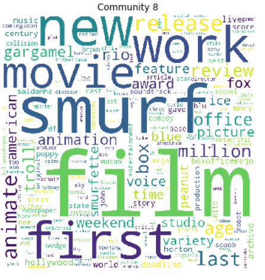
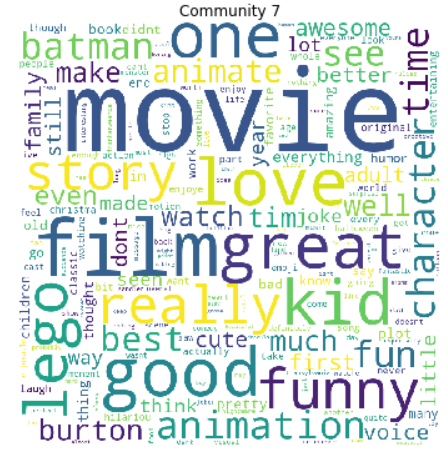
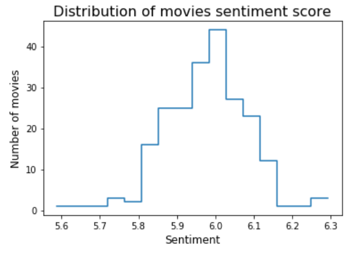
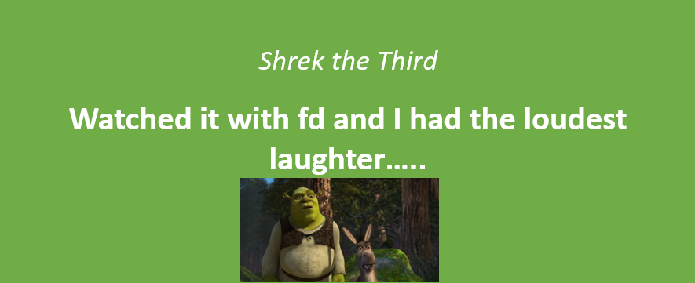
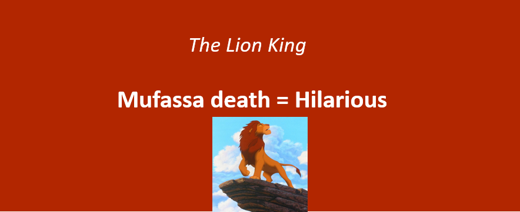

<!--<!DOCTYPE html>-->
<html lang="en">

<!--<head>-->

<!-- title and meta -->
<meta charset="utf-8" />
<meta name="viewport" content="width=device-width,initial-scale=1.0" />
<meta name="description" content="" />

<title> Animated Movies |  Social Graphs 2020</title>

<!-- css -->
<link href='https://fonts.googleapis.com/css?family=Ubuntu:300,400,700,400italic' rel='stylesheet' type='text/css'>
<link href='https://fonts.googleapis.com/css?family=Oswald:400,300,700' rel='stylesheet' type='text/css'>
<link rel="stylesheet" href="css/style.css" />
<!--<link rel="stylesheet" href="css/twitter-quotes.css">-->
<link rel="stylesheet" href="css/switch.css" />
<link rel="stylesheet" type="text/css" href="css/slick.css"/>
<link rel="stylesheet" type="text/css" href="css/slick-theme.css"/>
<link rel="stylesheet" type="text/css" href="css/bar.css"/>

<!-- js -->
<script src="js/classie.js"></script>
<script src="js/jquery-3.1.1.min.js"></script>
<script src="js/scroll.js"></script>
<script src="js/parallaxImg.js" type="text/javascript"></script>
<script src="js/parallaxImg.js"></script>
<script src="js/quotes.js"></script>
<script src="js/select.js"></script>
<script src="js/masonry.pkgd.min.js"></script>
<script src="js/jquery.flexslider-min.js"></script>
<script src="nodes_modules/d3/build/d3.min.js"></script>
<script src="nodes_modules/d3-tip/index.js"></script>
<script src="js/jquery.js" type="text/javascript"></script>
<meta name="viewport" content="width=device-width, initial-scale=1">
<link rel="stylesheet" href="https://www.w3schools.com/w3css/4/w3.css">
<style>
* {
  box-sizing: border-box;
}

.column {
  float: left;
  width: 50%;
  padding: 20px;
}

/* Clearfix (clear floats) */
.row::after {
  content: "";
  clear: both;
  display: table;
}
</style>


<h1 id="Motivation">Motivation</h1>

This website will take a closer look of animated movies from a broad selection of productions studios. So if you like animated movies and love watching movies ranging from the good old disney movie "Beauty and the Beast" to the new and modern pixar movie "Onward" this is the webstie for you. Animated movies are often filled with hidden messages and they all have a deeper meaning, that is one of the thing that make animated movies amazing to watch.  
<br>
<br>
Movie reviews from people are often very honest and direct when they are reviewing a movie. So this is a good foundation for an interesting sentiment analysis and hopefully be very clear which movies are good and which are not. The movie reviews are obtained from Rotten Tomatos. Furthermore it will be interesting to see if there is a connection between the movies either through the division of communities,through the production studio, year of release or budget.

The dataset these results are obtained by originates from each movies Wikipedia page<p style="color:blue;"><a href="https://github.com/signemik/SocialGraphsAnimateMovies/blob/main/Download/Movie_Data.xlsx">view Data</a></p>The Jupyter notebook with details is<p style="color:blue;"><a href="https://github.com/signemik/SocialGraphsAnimateMovies/blob/main/Download/Movie_Data.xlsx">view notebook</a></p>
  


<h1 id="contenttitle">Contents</h1>
                <p align="center"> <!--<class="contents">-->
                    <a href="#statistics"><br>
                    &rarr; Statistics</a><br><br>
                    <a href="#network"><br>
                    &rarr; Network Analysis</a><br><br>
                    <a href="#sentiments"><br>
                    &rarr; Sentiment Analysis</a><br><br>
                </p>
          
  
  
<section class="color" id="statistics">
 <div class="container">
       <h1>Statistics</h1>
   Below is the most interesting insights from the data set shown <br> 
   Firstly is the distribution of number of movies in the different production studios shown in the table below.
   <table rules="groups">
  <thead>
    <tr>
      <th style="text-align: center">Production Studio</th>
      <th style="text-align: center">Number of movies</th>
     </tr>
  </thead>
  <tbody>
    <tr>
      <td style="text-align: left">Sullivan Bluth Studio</td>
      <td style="text-align: left">8</td>
    </tr>
    <tr>
      <td style="text-align: left">DreamWorks</td>
      <td style="text-align: left">38</td>
    </tr>
    <tr>
      <td style="text-align: left">Blue Sky</td>
      <td style="text-align: left">13</td>
    </tr>
    <tr>
      <td style="text-align: left">Illumation</td>
      <td style="text-align: left">10</td>
    </tr>
    <tr>
      <td style="text-align: left">Warner Bros. Animation productions</td>
      <td style="text-align: left">15</td>
    </tr>
    <tr>
      <td style="text-align: left">Sony Pictures Animation productions</td>
      <td style="text-align: left">19</td>
    </tr>
    <tr>
      <td style="text-align: left">Pixar</td>
      <td style="text-align: left">23</td>
    </tr>
    <tr>
      <td style="text-align: left">Disney</td>
      <td style="text-align: left">95</td>
    </tr>
  </tbody>
</table>
   <br>
The majority of the movies in our dataset is Disney productions, next is DreamWorks and then Pixar. Next the different attribute is plotted agianst the realse year.
 <p align="center">
  
</p>
There is an increase in bugdet and gross for movies. However the profit in percent is decreasing this could do to the increase in bugdet and gross. Furthermore, the movies from 1940's has been reissue many times in the cinemas because at that time people did not have VHS or DVD so they could not buy the movies. This is propably why the profit in percent is high for movies made in 1940's. Next a closer look at the distributions for user score, where the ratining is between 0-5, of the reviews from Rotten Tomatos. 

<h2>User score</h2>
   <div class="row">
  <div class="column">
    
  </div>
  <div class="column">
    
  </div>
  </div>
  General we see that the reviewers are giving good scores to the movies from the distribution of user score. Only a few reviews has a score lower than 3.
  The distribution of the average user score follows a normal distribution where most movies have an user score about 3.6 to 3.7. In the table below the five best and worst movies based on average user score can be found.
  
<h3 style="text-align:left">Top 5 best movies based on average user scores</h3>
<table rules="groups">
  <thead>
    <tr>
      <th style="text-align: center">Movie</th>
      <th style="text-align: center">Average User Score</th>
      <th style="text-align: center">Production studio</th>
    </tr>
  </thead>
  <tbody>
    <tr>
      <td style="text-align: left">Spider-Man: Into the Spider-Verse</td>
      <td style="text-align: left">4.61</td>
      <td style="text-align: left">Sony Pictures Animation productions</td>
    </tr>
    <tr>
      <td style="text-align: left">Coco</td>
      <td style="text-align: left">4.56</td>
      <td style="text-align: left">Pixar</td>
    </tr>
    <tr>
      <td style="text-align: left">Abominable</td>
      <td style="text-align: left">4.49</td>
      <td style="text-align: left">Dreamworks</td>
    </tr>
    <tr>
      <td style="text-align: left">Toy Story 3</td>
      <td style="text-align: left">4.48</td>
      <td style="text-align: left">Pixar</td>
    </tr>
    <tr>
      <td style="text-align: left">The Lion King (1994)</td>
      <td style="text-align: left">4.45</td>
      <td style="text-align: left">Disney</td>
    </tr>
  </tbody>
</table>

<h3>Bottom 5 worst movies based on average user scores</h3>
<table rules="groups">
  <thead>
    <tr>
      <th style="text-align: center">Movie</th>
      <th style="text-align: center">Average User Score</th>
      <th style="text-align: center">Production studio</th>
    </tr>
  </thead>
  <tbody>
    <tr>
      <td style="text-align: left">Ice Age: Collision Course</td>
      <td style="text-align: left">2.42</td>
      <td style="text-align: left">Blue Sky</td>
    </tr>
    <tr>
      <td style="text-align: left">The Emoji Movie</td>
      <td style="text-align: left">2.64</td>
      <td style="text-align: left">Sony Pictures Animation productions</td>
    </tr>
    <tr>
      <td style="text-align: left">Home on the Range</td>
      <td style="text-align: left">2.68</td>
      <td style="text-align: left">Disney</td>
    </tr>
    <tr>
      <td style="text-align: left">The Wild</td>
      <td style="text-align: left">2.68</td>
      <td style="text-align: left">Disney</td>
    </tr>
    <tr>
      <td style="text-align: left">Doug's 1st Movie</td>
      <td style="text-align: left">2.74</td>
      <td style="text-align: left">Disney</td>
    </tr>
  </tbody>
</table>

<p align="center">
  
  </p>
  <!--<h2>Plots</h2>-->
It is clearly seen that Pixar has the best average user score, but overall the user score for the production studios is almost the same. All of them has good movies and bad movies that balanced that user score.

    
    
    
    <br>
<section class="color" id="network">
    <div class="container">
        <h1>Network analysis </h1>
      Below is the graph visualised, where an edge symbolize that there is a Wiki-link between the two movies Wikipedia pages.
      
      <br>
      The size of the nodes are based on node degree. There is a clear Disney, Pixar, DreamWorks and Sullivan cluster in the network. It is clear that Disney, Pixar and DreamWorks movies are the ones with the largest degree such as movies The Lion King, Frozen, Toy Story 3, Toy Story and Shrek. Below is the degree distribution visualised. 
      <p align="center">
      
        </p>
      Both in and out degree seems to follow a power law since many nodes have a low degree and a few nodes has a high degree. Accordingly, the network is scale-free.
      <br>
      <h2>Communities</h2>
      The network is diveded into communties by use of the Louvain algorithm. The pie charts below show the division between movies from the different production studios in each community.
       
      <br>
In each community with exception of community 7 there is a majority of movies from one production studio. In community 1 is it Pixar, community 2 is it DreamWorks, community 3 and 6 is it Disney, community 4 only consists of Sullivan movies, community 5 almost only consists of Disney movies, community 8 is it Blue Sky and community 9 is it Warner Bros. Community 7 is a mix of Warner Bros, Disney, Sony and DreamWorks. With further investigation the following conclusion can be made by each community.
      <br>
      <br>
      <ul>
  <li> Community 1: Some of the movies in this community are Despicable Me, Turbo, Toy Story, Finding Nemo.</li>
   <li> Community 2: Some of the movies in this community Sherk, How to train your Dragon, Kung Fu Panda, Madagascar, Goosebumps.</li>
    <li> Community 3:  In this community there are a lot of iconic and popular disney movies such as The Lion King, Beauty and the Beast (1991) and Aladdin (1992), which are all realeased around at the same time. </li>
        <li> Community 4: This community only consists of movies from Sullivan Bluth Studios. </li>
        <li> Community 5: This community mostly constits of the older Disney movies fx Dumbo, Bambi and Cinderella (1950). There are a few outliers such as Spider-Man Into the Spider-Verse and Pooh's Heffalump Movie which are Sony and Pixar productions. </li>
        <li> Community 6: There is a mix of different productions studios, where the majority is Disney. Some of the movies in this community are Frozen, Wreck-It Ralph and The Grinch. </li>
        <li> Community 7: Again there are a mix of production studios almost equally divided in this community. Some of the movies in this community are The Lego Movie, The Boss Baby, Hotel Transylvania and Gnomeo & Juliet. </li>
        <li> Community 8: In this community the majority are Blue Sky production movies. Some of the movies in this community are Ice Age, Trolls and The Smurfs. </li>
        <li> Community 9: This community is all about Tinker Bell and her five movies. These movies almost only link to each other and that is why they have their own community. </li>
      </ul>
      
A new graph is shown below where the nodes are colored by communities and its nodesize is based on production studio. The smallest node size is Disney and then it is Pixar, Warner Bros., Illumination, DreamWorks, Blue Sky, Sony Animation so the biggest nodesize is Sullivan. <br>
      
  
      
<br>
Below is the wordclouds for each community visualised. From the wordcloulds can it be seen which words are most important for each community based on the movies text from Wikipedia.
<style>
.mySlides {display:none}
</style>
<body>

<div class="w3-container">
  <h2>Wordclouds for communities based on Wikipedia pages</h2>
</div>


<div class="w3-content" style="max-width:800px">
  <p align="center">
  
  
  
  
  
  
  
  
  
  </p>
</div>
<div class="w3-center">
  <div class="w3-section">
    <button class="w3-button w3-light-grey" onclick="plusDivs(-1)">❮ Prev</button>
    <button class="w3-button w3-light-grey" onclick="plusDivs(1)">Next ❯</button>
  </div>
 <button class="w3-button demo" onclick="currentDiv(1)">1</button> 
  <button class="w3-button demo" onclick="currentDiv(2)">2</button> 
  <button class="w3-button demo" onclick="currentDiv(3)">3</button>
  <button class="w3-button demo" onclick="currentDiv(4)">4</button>
  <button class="w3-button demo" onclick="currentDiv(5)">5</button>
  <button class="w3-button demo" onclick="currentDiv(6)">6</button>
  <button class="w3-button demo" onclick="currentDiv(7)">7</button>
  <button class="w3-button demo" onclick="currentDiv(8)">8</button>
  <button class="w3-button demo" onclick="currentDiv(9)">9</button>
</div>

<script>
 var slideIndex = 1;
showDivs(slideIndex);

function plusDivs(n) {
  showDivs(slideIndex += n);
}

function currentDiv(n) {
  showDivs(slideIndex = n);
}

function showDivs(n) {
  var i;
  var x = document.getElementsByClassName("mySlides");
  var dots = document.getElementsByClassName("demo");
  if (n > x.length) {slideIndex = 1}
  if (n < 1) {slideIndex = x.length}
  for (i = 0; i < x.length; i++) {
    x[i].style.display = "none";  
  }
  for (i = 0; i < dots.length; i++) {
    dots[i].className = dots[i].className.replace(" w3-blue", "");
  }
  x[slideIndex-1].style.display = "block";  
  dots[slideIndex-1].className += " w3-blue";
}
</script>
<br>
At first sight the nine wordclouds look like each other. They all for example have the words <em>film, release, first, animate </em> and <em>new</em>. After furthere interestion, it is actually possible to seperate them from each other. <br> <br>
<ul>
  <li> Community 1: It has words as <em>disney, pixar, toy</em> and <em>story</em>, so it is actually possible from the wordcloud to see that this community has many pixar movies among Toy Story movies. </li>
   <li> Community 2: It is seen words such as <em>shrek, dreamworks, madagascar</em> and <em>panda</em>. </li>
     <li> Community 3: In community 3 words such as <em>disney, lion, king, song</em> and <em>aladdin</em> appears. </li>
       <li> Community 4: In community 4 words such as <em>thumbelina, pebble</em> and <em>bluth</em> appears which again are movies in the community and the production studio.</li> 
         <li>Community 5: Here words such as <em>disney, bambi, million</em> and <em>wal</em>'. It is not that easy to see which movies that are in community 5 besides that they are Disney movies. </li>
       <li>Community 6: In community 6 words such as <em>disney, frozen, million</em> and <em>movie</em>. Again it is not that easy to tell which movies besides from Frozen that are in community 6. </li>
       <li> Community 7: Some words in community 7 are <em>lego, batman</em> and <em>transylvania</em> appears, which are very definite for community 7. </li>
        <li> Community 8: In community 8 the words <em>smurf, gargamel, horton</em> and <em>scoob</em> appears. These words are also very definite for community 8. </li>
        <li> Community 9: In the last community 9 words such as <em>tinker, bell, disney, fairy</em> and <em>pirate</em>. As in the two last communities these words are also very definitive for community 9 since it only consists of Tinker bell movies. 

<br> <br>
Below wordclouds, where the text data is user reviews for eah community, are visualised.

 <style>
.mySlides3 {display:none}
</style>
<body>

<div class="w3-container">
  <h2>Wordclouds for communities based on user reviews</h2>
</div>


<div class="w3-content" style="max-width:800px">
  <p align="center">
  
  
  
  
  
  
  
  
  
  </p>
</div>
<div class="w3-center">
  <div class="w3-section">
    <button class="w3-button w3-light-grey" onclick="plusDivs3(-1)">❮ Prev</button>
    <button class="w3-button w3-light-grey" onclick="plusDivs3(1)">Next ❯</button>
  </div>
 <button class="w3-button demo3" onclick="currentDiv3(1)">1</button> 
  <button class="w3-button demo3" onclick="currentDiv3(2)">2</button> 
  <button class="w3-button demo3" onclick="currentDiv3(3)">3</button>
  <button class="w3-button demo3" onclick="currentDiv3(4)">4</button>
  <button class="w3-button demo3" onclick="currentDiv3(5)">5</button>
  <button class="w3-button demo3" onclick="currentDiv3(6)">6</button>
  <button class="w3-button demo3" onclick="currentDiv3(7)">7</button>
  <button class="w3-button demo3" onclick="currentDiv3(8)">8</button>
  <button class="w3-button demo3" onclick="currentDiv3(9)">9</button>
</div>

<script>
 var slideIndex = 1;
showDivs3(slideIndex);

function plusDivs3(n) {
  showDivs3(slideIndex += n);
}

function currentDiv3(n) {
  showDivs3(slideIndex = n);
}

function showDivs3(n) {
  var i;
  var x = document.getElementsByClassName("mySlides3");
  var dots = document.getElementsByClassName("demo3");
  if (n > x.length) {slideIndex = 1}
  if (n < 1) {slideIndex = x.length}
  for (i = 0; i < x.length; i++) {
    x[i].style.display = "none";  
  }
  for (i = 0; i < dots.length; i++) {
    dots[i].className = dots[i].className.replace(" w3-blue", "");
  }
  x[slideIndex-1].style.display = "block";  
  dots[slideIndex-1].className += " w3-blue";
}
</script>
<br>
In these wordcloud it is see words such as <em>movie, love, great, good</em> and <em>really</em> in all communities though in different sizes. For example the movies must be more funny in community 2 than in community 1, since the word <em>funny</em> appears bigger in community 2 than in 1. Overall the wordclouds are very positive, so in general the reviews uses positive words. It is still see that the majority of the movies in community 1 are Pixar movies and in community 3, 5 and 6 the majority are Disney movies. In community 9 it is also very clear that Tinker bell movies are in this community.  
<br>                    
 
<section class="color" id="sentiments">
 <div class="container">
       <h1>Sentiment analysis</h1>
   In the sentiment analysis the emotion of the reviews are analyzed. To begin with the distribution of sentiment for the user reviews is shown. 
   <h2>Setiment</h2>

   <div class="row">
  <div class="column">
    
  </div>
  <div class="column">
    
  </div>
  </div>
  The distribution of sentiment seems to be normal distributed around 6 which is neutral. The range of sentiment is where, 1 is sad and 9 is happy. Additionally,
  the sentiment of movies also seems to follow a normal distribution around 6. The average sentiment of the movies indicates that all the good and bad reviews balance each other out. However we are still interested in finding the movies with the highest and the lowest sentiment.
  
  <h2>Top 5 movies based on average sentiment</h2>
<table rules="groups">
  <thead>
    <tr>
      <th style="text-align: center">Movie</th>
      <th style="text-align: center">Average Sentiment</th>
      <th style="text-align: center">Average User Score</th>
      <th style="text-align: center">Production studio</th>
    </tr>
  </thead>
  <tbody>
    <tr>
      <td style="text-align: left">Abominable</td>
      <td style="text-align: left">6.29</td>
      <td style="text-align: left">4.49</td>
      <td style="text-align: left">Dreamworks</td>
    </tr>
    <tr>
      <td style="text-align: left">The Secret Life of Pets 2</td>
      <td style="text-align: left">6.27</td>
      <td style="text-align: left">4.26</td>
      <td style="text-align: left">Illumination</td>
    </tr>
    <tr>
      <td style="text-align: left">Shrek 2</td>
      <td style="text-align: left">6.25</td>
      <td style="text-align: left">3.83</td>
      <td style="text-align: left">Dreamworks</td>
    </tr>
    <tr>
      <td style="text-align: left">Spies in Disguise</td>
      <td style="text-align: left">6.22</td>
      <td style="text-align: left">4.33</td>
      <td style="text-align: left">Blue Sky</td>
    </tr>
    <tr>
      <td style="text-align: left">The Star</td>
      <td style="text-align: left">6.18</td>
      <td style="text-align: left">4.17</td>
      <td style="text-align: left">Sony Pictures Animation productions</td>
    </tr>
  </tbody>
</table>

 <h2>Worst 5 movies based on average sentiment</h2>
<table rules="groups">
  <thead>
    <tr>
      <th style="text-align: center">Movie</th>
      <th style="text-align: center">Average Sentiment</th>
      <th style="text-align: center">Average User Score</th>
      <th style="text-align: center">Production studio</th>
    </tr>
  </thead>
  <tbody>
    <tr>
      <td style="text-align: left">Victory Through Air Power</td>
      <td style="text-align: left">5.59</td>
      <td style="text-align: left">3.25</td>
      <td style="text-align: left">Disney</td>
    </tr>
    <tr>
      <td style="text-align: left">The Emoji Movie</td>
      <td style="text-align: left">5.67</td>
      <td style="text-align: left">2.64</td>
      <td style="text-align: left">Sony Pictures Animation productions</td>
    </tr>
    <tr>
      <td style="text-align: left">Shark Tale</td>
      <td style="text-align: left">5.72</td>
      <td style="text-align: left">2.95</td>
      <td style="text-align: left">Dreamworks</td>
    </tr>
    <tr>
      <td style="text-align: left">The Black Cauldron</td>
      <td style="text-align: left">5.72</td>
      <td style="text-align: left">3.11</td>
      <td style="text-align: left">Disney</td>
    </tr>
    <tr>
      <td style="text-align: left">Ice Age: Collision Course</td>
      <td style="text-align: left">5.72</td>
      <td style="text-align: left">2.42</td>
      <td style="text-align: left">Blue Sky</td>
    </tr>
  </tbody>
</table>
<br>
The best movie is Abominable with a sentiment of 6.29 and the worst is Victory Through Air Power with a sentiment of 5.59.  There is a small tendency when the sentiment are high the average user score are high as well. This is visualised below to see if the trend are visible.

 <p align="center">
   </p>
  
 There is a clear trend in the sentiment vs. average user score, however which words are more used in the reviews with low sentiment and high sentiment? This is shown below using wordclouds.
   <h2>Words used in the best and worst reviews</h2>

<div class="row">
  <div class="column">
    
  </div>
  <div class="column">
    
  </div>

<br><br>
There is a clear difference in the two wordclouds. It is clear to see that the 250 best reviews are using more positive words than the 250 worst reviews. In the data cleaning process the letter <em>s</em> was removed from the end of the words (also on words where it is actually wrong like the word hilarious). Furthermore it is seen that some words are misspelled which was not taking into account, when data was cleaned. That is why the word 'hilarious' and 'hillarious' appears. 
<br>
The word <em>Shrek</em> in both wordclouds, it can be because <em>Shrek</em> has been giving both negative og positive reviews, but it can also be because words with a bad happiness average has been used in a positive way like <em>I really liked that they killed the bad person, he was very annoying and deserved a horrible death</em>, this would actually be kind of positive because it was something the person liked about the movie, but bacause there are so many words with low sentiment the overall sentiment would be bad. This is probaly the case with the word <em> Mufassa</em>, beacuse the Lion King has a good user score. 
<br>
The wordcloud of 250 best reviews are using words such as <em>love, fabolous, hilarious, fluffy, minion</em> and <em>laugther</em> where the wordcloud of 250 worst reviews are using words such as <em>worst, depressing, die, poor</em> and <em>hate</em>. 

Below can the three best and worst reviews be seen based on there sentiment.
  
<div class="w3-container">
  <h2>Top 3 reviews</h2>
  
</div>


<div class="w3-content" style="max-width:800px">
  <p align="center">
  
  
  
  </p>
</div>
<div class="w3-center">
  <div class="w3-section">
    <button class="w3-button w3-light-grey" onclick="plusDivs1(-1)">❮ Prev</button>
    <button class="w3-button w3-light-grey" onclick="plusDivs1(1)">Next ❯</button>
  </div>
 <button class="w3-button demo1" onclick="currentDiv1(1)">1</button> 
  <button class="w3-button demo1" onclick="currentDiv1(2)">2</button> 
  <button class="w3-button demo1" onclick="currentDiv1(3)">3</button>
</div>

<script>
 var slideIndex = 1;
showDivs1(slideIndex);

function plusDivs1(n) {
  showDivs1(slideIndex += n);
}

function currentDiv1(n) {
  showDivs1(slideIndex = n);
}

function showDivs1(n) {
  var i;
  var x = document.getElementsByClassName("mySlides1");
  var dots = document.getElementsByClassName("demo1");
  if (n > x.length) {slideIndex = 1}
  if (n < 1) {slideIndex = x.length}
  for (i = 0; i < x.length; i++) {
    x[i].style.display = "none";  
  }
  for (i = 0; i < dots.length; i++) {
    dots[i].className = dots[i].className.replace(" w3-blue", "");
  }
  x[slideIndex-1].style.display = "block";  
  dots[slideIndex-1].className += " w3-blue";
}
</script>

<br>
In the three best reviews the word <em>laugther</em> is present, which is the word with highest sentiment value. Therefor it make sense that the word appear in all three reviews.
<div class="w3-container">
  <h2>Worst 3 reviews</h2>
</div>


<div class="w3-content" style="max-width:800px">
  <p align="center">
  
  
  
  </p>
</div>
<div class="w3-center">
  <div class="w3-section">
    <button class="w3-button w3-light-grey" onclick="plusDivs2(-1)">❮ Prev</button>
    <button class="w3-button w3-light-grey" onclick="plusDivs2(1)">Next ❯</button>
  </div>
 <button class="w3-button demo2" onclick="currentDiv2(1)">1</button> 
  <button class="w3-button demo2" onclick="currentDiv2(2)">2</button> 
  <button class="w3-button demo2" onclick="currentDiv2(3)">3</button>
</div>

<script>
 var slideIndex = 1;
showDivs2(slideIndex);

function plusDivs2(n) {
  showDivs2(slideIndex += n);
}

function currentDiv2(n) {
  showDivs2(slideIndex = n);
}

function showDivs2(n) {
  var i;
  var x = document.getElementsByClassName("mySlides2");
  var dots = document.getElementsByClassName("demo2");
  if (n > x.length) {slideIndex = 1}
  if (n < 1) {slideIndex = x.length}
  for (i = 0; i < x.length; i++) {
    x[i].style.display = "none";  
  }
  for (i = 0; i < dots.length; i++) {
    dots[i].className = dots[i].className.replace(" w3-blue", "");
  }
  x[slideIndex-1].style.display = "block";  
  dots[slideIndex-1].className += " w3-blue";
}
</script>
<br>
The three worst reviews is all about death. However, the second review is a false negative, because the user loved The Incredibles so much that the user wacth the movie many times.  


<!--
## Welcome to GitHub Pages
<!--
You can use the [editor on GitHub](https://github.com/signemik/SocailGraphsAnimateMovies/edit/main/README.md) to maintain and preview the content for your website in Markdown files.
<!--
Whenever you commit to this repository, GitHub Pages will run [Jekyll](https://jekyllrb.com/) to rebuild the pages in your site, from the content in your Markdown files.
<!--
### Markdown
<!--
Markdown is a lightweight and easy-to-use syntax for styling your writing. It includes conventions for
<!--
```markdown
Syntax highlighted code block
<!--
# Header 1
## Header 2
### Header 3
<!--
- Bulleted
- List
<!--
1. Numbered
2. List
<!--
**Bold** and _Italic_ and `Code` text
<!--
## Images
 
<!--This is a comment-->
<!---->
<!--
[Link](url) and 
```
<!--
For more details see [GitHub Flavored Markdown](https://guides.github.com/features/mastering-markdown/).
<!--
### Jekyll Themes
<!--
Your Pages site will use the layout and styles from the Jekyll theme you have selected in your [repository settings](https://github.com/signemik/SocailGraphsAnimateMovies/settings). The name of this theme is saved in the Jekyll `_config.yml` configuration file. -->
<!--
### Support or Contact
<!--
Having trouble with Pages? Check out our [documentation](https://docs.github.com/categories/github-pages-basics/) or [contact support](https://github.com/contact) and we’ll help you sort it out.-->
